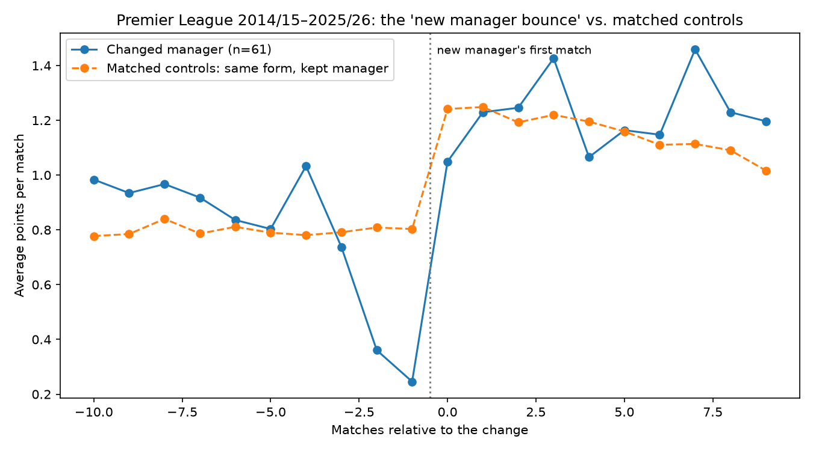
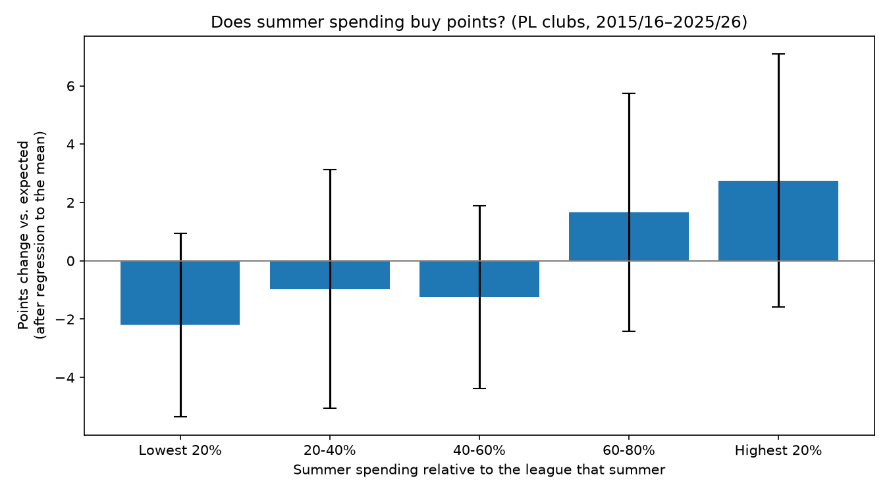

# Findings

## Q1: Is the "new manager bounce" real?

**Mostly not. About 86% of it happens anyway.**

Teams that change manager mid-season are in relegation form (0.78 points per game over the previous 10 matches) and improve sharply afterwards (1.22 PPG). But teams in the **same** form, including a similar recent slump, that **kept** their manager improved almost as much.

| (61 mid-season changes) | Changed manager | Kept manager | Effect | 95% CI |
|---|---|---|---|---|
| Points per game | +0.44 | +0.38 | **+0.06** | −0.07 to +0.19 |
| Points vs. betting expectation | +0.45 | +0.36 | +0.09 | −0.02 to +0.20 |
| xG difference per game | +0.27 | +0.24 | +0.04 | −0.10 to +0.18 |
| Expected points (fixture difficulty) | −0.01 | +0.02 | −0.02 | −0.07 to +0.02 |

- **Results:** no reliable effect. The confidence interval includes zero. The recovery is mostly **regression to the mean**: clubs sack managers at an unusually bad moment, and unusually bad runs end regardless.
- **Fixtures** don't explain the recovery: expected points from betting odds barely change.
- **Caretakers vs. permanent managers:** both get a similar bump in results. Only permanent appointments show better **underlying performance** (xG difference +0.22 per game, 95% CI +0.01 to +0.42), while caretakers show none (−0.05). **Suggestive, not conclusive** (see limitations).

### Method

Event study with matched controls (`src/analysis/manager_bounce.py`):
- **Events:** mid-season changes with a settled predecessor and 10 matches before and after in the same season.
- **Controls:** windows where a team kept the same manager for 10 matches either side.
- **Matching:** each event is compared with controls within ±0.10 PPG over the previous 10 matches **and** within 1 point over the previous 3.
- **Effect:** the treated team's change minus the matched controls' average change.
- **Version history:** matching on 10-game form only (v1) gave +0.08 PPG; adding recent form (v2) gave +0.06. Better controls, smaller effect.

### Limitations

- Only 61 of 127 mid-season changes have full windows in the same season. Late-season changes and changes quickly followed by another are excluded.
- **16 comparisons** were run (4 metrics × 4 groups), so one borderline "significant" result could be chance.
- Control windows overlap (the same team in neighbouring weeks), so the confidence intervals are somewhat too narrow.
- Sacked teams' last 2 matches before the change were worse than their controls' (≈0.3 vs ≈0.5 PPG). If anything, this makes the estimated effect **too large**.
- Observational data: clubs choose *when* to sack, so no method fully removes that choice.

## Q2: Does summer transfer spending buy points?

**A little, with diminishing returns. The effect is consistently positive but statistically fragile.**

Regression over 187 club-seasons (2015/16–2025/26; promoted clubs excluded). The outcome is the change in points vs. the previous season, controlling for last season's points and xG difference (`src/analysis/spending_effect.py`).

- **Regression to the mean dominates:** each extra point last season predicts 0.83 fewer points of improvement this season (95% CI −1.06 to −0.60).
- **Spending one extra league-average summer** (€152m in 2023/24) is linked to about **+2.2 to +2.7 points**, roughly one extra win.
- **Diminishing returns:** with log spending, going from zero to the league average is worth about +3.8 points; from average to double, about +2.2 more.
- **Underlying performance improves too:** +0.10 xG difference per game (p = 0.003).
- **The biggest spenders are hit-and-miss:** of the five biggest relative spending summers, one produced +22 points (Man City 2017/18) and one −13 (Man City 2015/16).

| Robustness check | Spending effect | 95% CI | p |
|---|---|---|---|
| Main model (with new manager) | +2.2 pts | −0.0 to +4.4 | 0.052 |
| Log spending | positive | +0.3 to +10.5 (per log unit) | 0.037 |
| Top 5% of spenders removed | +2.4 pts | −0.9 to +5.7 | 0.152 |

The **size** of the effect is stable across checks; its **significance** is not.

## Q3: Money vs. manager

| Decision | Effect on points | Evidence |
|---|---|---|
| **Mid-season manager change** | ≈ 0 (+0.06 PPG, CI includes 0) | 61 events, matched controls |
| **Summer manager change** | **≈ +5 points** (CI +0.6 to +9.5) | 35 changes; stable across all checks, p 0.03–0.05 |
| **Summer spending (+1 league-average summer)** | ≈ +2–3 points | 187 club-seasons; stable size, fragile significance |

**Timing seems to matter more than the decision itself.** A manager appointed in summer, with a pre-season and a transfer window to shape the squad, is linked to about twice the points of an extra league-average transfer budget. A mid-season sacking shows no reliable effect beyond regression to the mean.

### Limitations

- **Correlation, not causation:** clubs that spend or change manager may differ in ways the model doesn't capture (new owners, ambition, injuries).
- **Gross, not net, spending:** outgoing sales aren't in the data, so replacing a sold star looks like new investment.
- **Different methods:** Q1 is an event study, Q2/Q3 a season-level regression. The summer vs. mid-season contrast is suggestive, not a controlled comparison.
- **Small samples:** 35 summer manager changes; borderline p-values should be read as evidence, not proof.